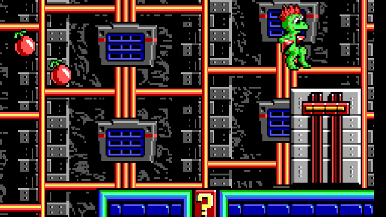

+++
title = "Foot Switches"
description = "Describes the actor tick function for foot-actuated switches."
weight = 510

actorTypes = [59, 61, 120, 121]
+++

# Foot Switches

The **Foot Switches** are player-sized interactive objects that can be pressed down under the weight of the player or by the force imparted by a nearby [explosion](). Switches have five positions; the upper four positions represent the "off" state and the lowest position is "on."



Each player pounce moves the switch down by one position with an associated "beep" sound effect, requiring a total of four pounces to fully activate a switch. An explosion will also move the switch most of the way, but a second explosion or additional player pounce is required to fully activate it. A switch cannot be moved back up, and once a switch is activated it remains permanently in that state.

The **tracks** of the switch are built using a careful arrangement of map tiles. The **knob** of the switch is a sprite. When the player interacts with the knob--either by standing on it or trying to walk into it--the movement-blocking behavior is due to [tile attributes]() on the _track_ tiles. The switch activation, however, is based on an intersection test between the player sprite and the knob sprite. Each switch actor must ensure that its map tiles and knob position remain in sync with each other.



## Data Fields

`data1`
: The current position of the switch, ranging from zero (never interacted with) to four (fully activated). This value increments as the knob moves down on the screen.

`data2`
: This is a one-shot flag that controls the value in `data3`. This is zero initially, and is permanently set to one after the switch has moved out of its initial position.

`data3`
: The current map tile adjustment value. Depending on the position of the switch knob, the track tiles drawn behind it may or may not need a notch at their top edges. (This is a consequence of the art direction of the game graphics.) This field controls the shift between the notched and un-notched sets of tiles. As the switch first moves out of its initial position, this takes the value 64. On all subsequent moves, this value is zero.

`data4`
: This is the "hit" signal. When either the player or an explosion has interacted with the switch knob in the proper way, this value is set to one to move the switch. Once the switch processes the hit, this resets to zero.

`data5`
: The actor type of this switch, used to determine what should happen when the activated state is reached.

`westfree`
: This is a one-shot flag that controls the overall initialization of the switch. This starts at zero, which signals that the movement-blocking track tiles need to be inserted into the map for the first time. Once this happens, the switch is ready for use and the flag is set to one.

## Initial Values

<table>
    <tr>
        <th>Actor Type</th>
        <th> (29)</th>
        <th> (35)</th>
        <th> (37)</th>
        <th> (58)</th>
    </tr>
    <tr><th>Sprite Type</th><td colspan="4"></td></tr>
    <tr><th>X Shift</th><td colspan="4">0</td></tr>
    <tr><th>Y Shift</th><td colspan="4">0</td></tr>
    <tr><th>Force Active</th><td colspan="4">no</td></tr>
    <tr><th>Stay Active</th><td colspan="4">no</td></tr>
    <tr><th>Weighted</th><td colspan="4">no</td></tr>
    <tr><th>Acrophile</th><td colspan="4">no</td></tr>
    <tr><th>Data 1</th><td colspan="4">0</td></tr>
    <tr><th>Data 2</th><td colspan="4">0</td></tr>
    <tr><th>Data 3</th><td colspan="4">0</td></tr>
    <tr><th>Data 4</th><td colspan="4">0</td></tr>
    <tr>
        <th>Data 5</th>
        <td></td>
        <td></td>
        <td></td>
        <td></td>
    </tr>
</table>

## Visual Construction

Upon close examination of switch positions 1--3 in the earlier diagram, it should be apparent that each position along the track is separated by a notch in the tile graphics. The notch is composed of light line at the top of each position, and a dark line at the bottom of each position. The two end positions are taller -- position zero doesn't have a top line and position four doesn't have a bottom line. There are three styles of track tile in total: a style with only the bottom line, another with only the top line, and another style with both lines. The [tile attributes]() of these tile sets permits all movement through them.

The game implements movement-blocking at the switch knob by maintaining a duplicate set of track tiles, keeping the same visual appearance but changing the movement-blocking attributes to prohibit the player from walking or falling through the knob's territory.

Unfortunately, the separation and swapping of these tiles in the final game is not exactly pure. As released, the game has _one_ set of movement-blocking switch tiles, and these have the line at both the top and bottom. This is appropriate for positions 1--3, but would result in an errant white line at the top of position zero and a dark line at the bottom of position four. This is normally not a problem because the switch knob sprite completely covers these the movement-blocking track tiles, but _sometimes it doesn't._

During the frame where the switch moves from position zero to one, the [game loop]() draws the map as usual, faithfully displaying the movement-blocking tiles at position zero. These have the errant top line, which the switch knob sprite had been covering up. The switch progression code in  runs, which replaces the tiles in position zero with their passable counterparts, and replaces the tiles at position one with the impassible tiles. The knob's Y position is also moved one tile lower on the screen, where it is drawn for this frame. The sprite is no longer covering up the map tiles that have already been drawn in position zero, and even though the map tiles and sprite position are internally consistent for their appearance at position one, the old map tiles in position zero are left uncovered on the screen for the remainder of the frame.



Starting with the subsequent frame, everything is drawn consistently from the beginning and the glitch goes away. But for one frame after any switch moves from position zero to one, there is a horizontal white line visible that should not be there.

## Player Interaction

The switch knob sprite appears to be a 4 &times; 1 tile bar, but the sprite is actually two tiles tall. The visible portion occupies the lower row of the sprite, and the upper row is transparent space that is not drawn. This transparent space counts in intersection tests, so the player sprite is considered to be touching the sprite if their feet are directly above the visible part of the knob.

Inside the  function, this case occurs every time a switch actor is touching the player's sprite:

```c
    case SPR_FOOT_SWITCH_KNOB:
        if (act->data1 < 4 && act->data4 == 0) {
            isPlayerFalling = true;
            ClearPlayerDizzy();
            TryPounce(3);

            act->data1++;
```
This responds to actors having the  sprite type. In order to successfully move the switch, the switch must not already be in its final position (so, `data1` must be less than four) and the switch must not have already been hit during this tick (so, `data4` must be zero).

Because the switch knob is shadowed by movement-blocking map tiles, the player would be considered to be standing on solid ground by the normal logic of the game. Instead of allowing that to happen, the player is forced into a recoil by setting  to true and calling  for its side effects (the player needs to recoil for three ticks off this switch).  is also called, canceling the "dizzy" immobilization that may have occurred if the player fell from a great distance and landed on the switch. Strictly speaking, only the effect of  is important for the recoil behavior.

The switch's `data1` field is incremented, selecting the next position in the progression.

```c
            if (act->data2 == 0) {
                act->data3 = 64;
                act->data2 = 1;
            } else {
                act->data3 = 0;
            }
```

As the switch moves along its track, it writes and rewrites map tiles. The design of the switch graphics is such that the tiles at position zero have a distinctly different design than all the positions beneath it. This necessitates changing which map tiles are restored during the  call that will occur later during this tick. `data3` holds the offset value that selects the appropriate set of tiles. For the topmost switch position, the `data3` offset should be 64, and for all other positions it is zero (this is simply a consequence of how the [solid tile graphics]() pertaining to switch tracks are arranged). `data2` is a latching flag that controls this offset value, keeping the `data3` value at zero for all subsequent interactions.

```c
            act->data4 = 1;
        }

        return false;
```

Still in side the outer `if`, the final step is to set the `data4` flag to indicate that the switch has been successfully hit by the player and it should move during the next  call.

Switches return `false` unconditionally. Per 's conventions, this is the appropriate value for an actor that cannot be destroyed.



 is the tick function for every foot switch actor. It takes the `index` of the current actor in the actors array.

```c
void ActFootSwitch(word index)
{
    Actor *act = actors + index;

    if (act->sprite != SPR_FOOT_SWITCH_KNOB) return;
```

The passed `index` is added to the  array, locating the  structure for the switch being processed. `act` is the pointer to this actor.

This function is used for a number of unrelated actors that do not have specific per-frame behavior defined. (It's not known why those actors didn't use a dedicated no-op function.) To differentiate real switches from other actors that don't need to be serviced, the `act->sprite` member is tested. If it doesn't match , this actor is not actually a switch and doesn't need to run further. An early `return` skips the rest of the function.

```c
    if (act->westfree == 0) {
        act->westfree = 1;

        SetMapTile4(
            TILE_SWITCH_BLOCK_1, TILE_SWITCH_BLOCK_2,
            TILE_SWITCH_BLOCK_3, TILE_SWITCH_BLOCK_4,
            act->x, act->y
        );
    }
```

Foot switches require more than the five `data1`--`data5` variables provided, so here `westfree` is repurposed as an additional flag.

Each actor is created with its `westfree` set to zero, allowing the `if` body to run, then `westfree` is immediately updated to one. This produces a one-shot initialization, using  to rewrite the values of four consecutive map tiles starting at the switch knob's `x`/`y` position.

The values written are  through , which are four impassible tiles that occupy the same area of the map that the switch knob covers. It is these tiles which allow the player to sense that the switch knob is solid.

{}As highlighted in the [Visual Construction](#visual-construction) section, the tiles written here are not the correct ones for the switch's zeroth position, and contribute to a flashed white line at the moment the switch moves from position zero to one.{}

```c
    if (act->data4 != 0) {
        act->data4 = 0;

        SetMapTile4(
            (TILE_SWITCH_FREE_1L - act->data3),
            (TILE_SWITCH_FREE_1L - act->data3) + 8,
            (TILE_SWITCH_FREE_1L - act->data3) + 16,
            (TILE_SWITCH_FREE_1L - act->data3) + 24,
            act->x, act->y
        );

        act->y++;

        SetMapTile4(
            TILE_SWITCH_BLOCK_1, TILE_SWITCH_BLOCK_2,
            TILE_SWITCH_BLOCK_3, TILE_SWITCH_BLOCK_4,
            act->x, act->y
        );
```

A relatively large `if` body reacts to the condition where `data4` is nonzero. This occurs at the instant when the player (or an explosion) hits the switch knob. As soon as the switch begins to respond, `data4` is set back to zero to prevent it from moving more than one position in a given tick.

The first call to  restores the map tiles at the knob's current (old) `x`/`y` position with tiles that permit movement. `data3` is 64 during the initial switch hit and zero on each subsequent hit. ` - 64` evaluates to 3D68h, which is the value of a passable track tile with no line at the top of it. This is the appropriate thing to show when the switch's zeroth position is restored. On subsequent hits the result becomes ` - 0` (3DA8h) which is a passable track tile with the top line present. This is appropriate for all other switch positions. Because solid tiles are indexed by a value that increments in steps of eight, each tile value passed to  needs to be eight larger than the previous tile.

The `y` position of the knob is then incremented, moving it down on the screen. The second  call rewrites the map tiles at this new position with movement-blocking variants  through .

```c
        if (act->data1 == 4) {
            StartSound(SND_FOOT_SWITCH_ON);

            switch (act->data5) {
            case ACT_SWITCH_PLATFORMS:
                arePlatformsActive = true;
                break;

            case ACT_SWITCH_MYSTERY_WALL:
                mysteryWallTime = 4;
                if (!sawMysteryWallBubble) {
                    sawMysteryWallBubble = true;
                    NewActor(ACT_SPEECH_WHOA, playerX - 1, playerY - 5);
                }
                break;

            case ACT_SWITCH_LIGHTS:
                areLightsActive = true;
                break;

            case ACT_SWITCH_FORCE_FIELD:
                areForceFieldsActive = false;
                break;
            }
```

During a switch hit, if `data1` reaches the value four, the switch has moved through all of its upper positions and has finally reached the bottom, placing it into its activated state. This is emphasized by the  effect, queued for playback via .

The `switch` statement (no relation) examines the value in `data5` to determine which effect this switch should have on the game:

* For , the  variable is set to true. This allows all of the map's [platforms]() to begin moving.
* For , the  variable is set to a nonzero value, starting the  animation sequence. The literal value `4` is not actually important; any nonzero value would suffice.
* For , the  variable is set to true. This turns on the map's lights and subtly alters the behavior of any  on the map.
* For , the  variable is set to false. This turns off the map's , permitting the player to reach areas that may not have been safely accessible before.

In the  case, the  flag is tested to see if the player has encountered the feature before. If not, this flag is set and  inserts a  () actor centered above the current / position.

```c
        } else {
            StartSound(SND_FOOT_SWITCH_MOVE);
        }
    }
```

In the alternate case, the switch moved as a result of this hit but not far enough to activate it. Here, only  is queued by . It will take one or more subsequent hits to activate the switch.

```c
    if (
        act->data1 < 4 && act->data4 == 0 &&
        IsNearExplosion(SPR_FOOT_SWITCH_KNOB, 0, act->x, act->y)
    ) {
        act->data1++;

        if (act->data2 == 0) {
            act->data3 = 64;
            act->data2 = 1;
        } else {
            act->data3 = 0;
        }

        act->data4 = 1;
    }
}
```

The remaining code handles the case where a nearby explosion is moving the switch. In order to qualify for this movement, the switch must not be in its final activated position (so, `data1` must be less than four) and the switch must not have already been hit by a player or different explosion during this frame (so, `data4` must be zero).  will return true if any explosion is close enough to the switch knob to move it. If all three of these cases pass, the switch should move.

The `if` body is a copy of what occurs inside the [player interaction](#player-interaction) section above, so the description will not be repeated here.
